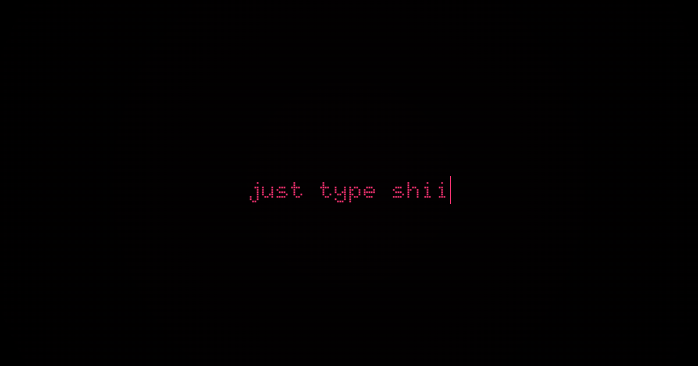

# Just Type Shii 🗿

# [Visit](https://just-type-shii.vercel.app/)



## Contributing

First off, thanks for showing interest in contributing to **Just Type Shii** 🗿 — whether it’s fixing a bug, adding a feature, or just improving docs, all help is welcome!

### 1. Fork & Clone the Repo

```bash
# Fork this repository on GitHub, then:
git clone https://github.com/megh-bari/just-type-shii
cd just-type-shii
```

### 2. Create a New Branch

Always create a branch for your changes instead of working directly on `main`.

```bash
git checkout -b feat/your-feature-name
```

Examples:

* `feat/new-feat-name`
* `fix/export-menu-bug`

### 3. Install Dependencies

```bash
pnpm install
# or
yarn install
# or
npm install
```

### 4. Run the Dev Server

```bash
pnpm dev
# or
yarn dev
# or
npm run dev
```

Visit [http://localhost:3000](http://localhost:3000) to see your changes live.

### 5. Make Your Changes

* Keep the code style consistent.
* Test everything locally before committing.
* If it’s UI-related, attach a screenshot in your PR.

### 6. Commit Your Changes

Use [conventional commits](https://www.conventionalcommits.org/) for clarity:

```bash
git add .
git commit -m "feat: add <feature>"
```

### 7. Push to Your Branch

```bash
git push origin feat/your-feature-name
```

### 8. Open a Pull Request (PR)

* Go to your fork on GitHub and click **"New pull request"**.
* Clearly describe what you changed and why.
* Link to any related issues if possible.

### 9. Review & Merge

We’ll review your PR, suggest changes if needed, and merge once it’s good to go.

## Built By

- Twitter: [@meghtrix](https://x.com/meghtrix)
- GitHub: [@megh-bari](https://github.com/megh-bari)

If you like this project, consider giving it a ⭐️ on GitHub and sharing it with others!


>type shii!